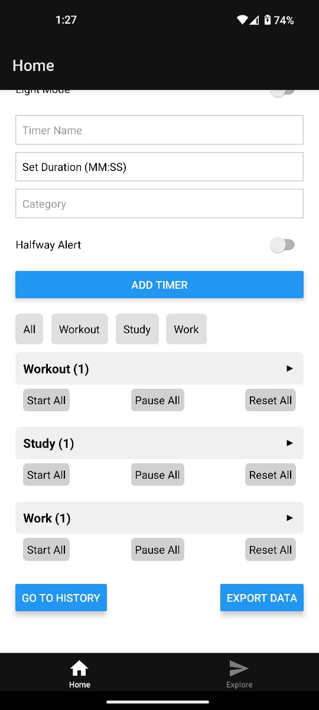
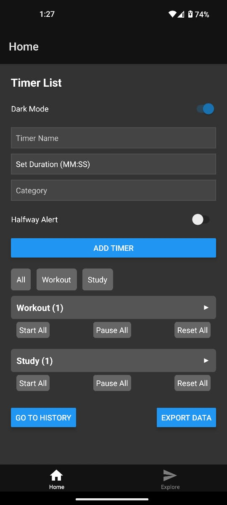
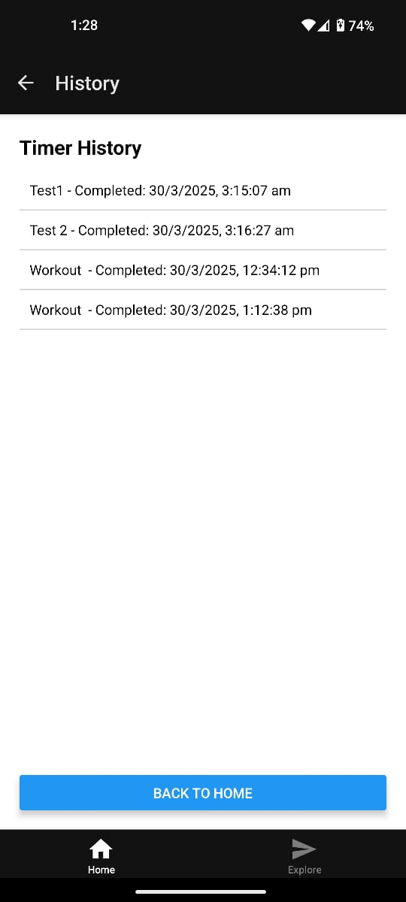
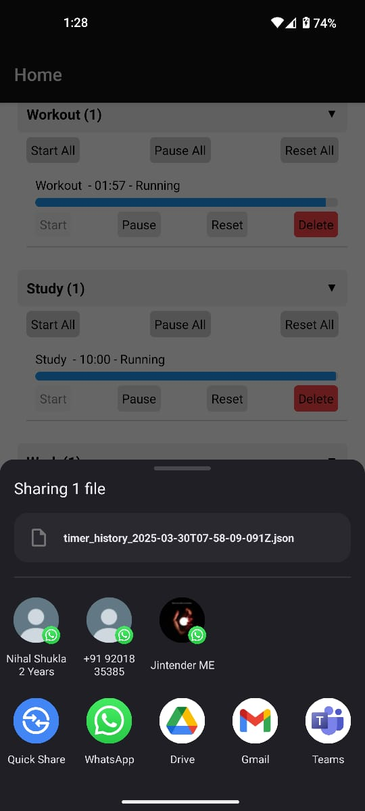
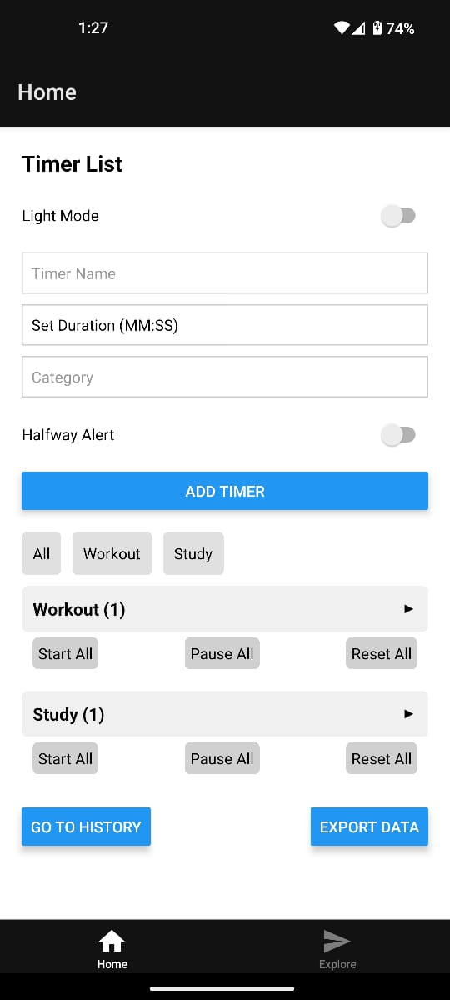
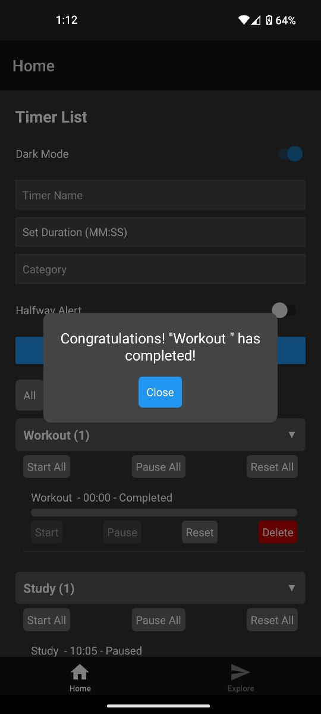
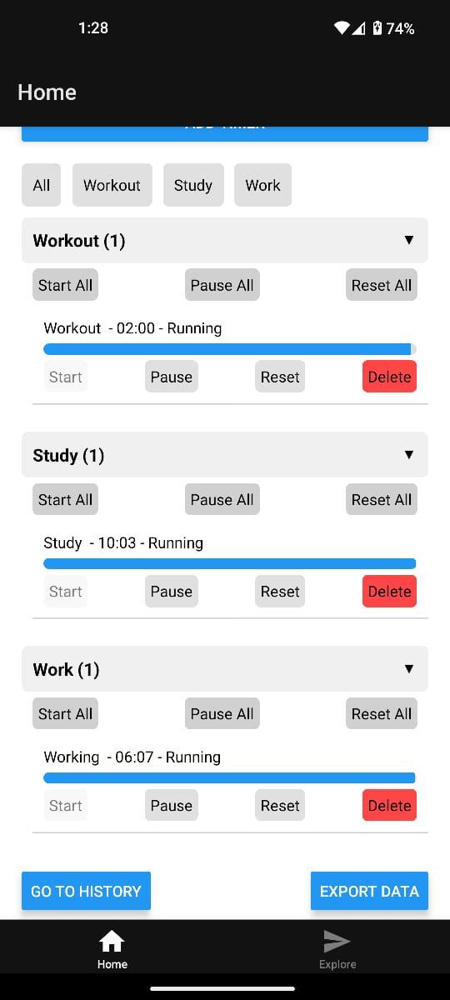

# Timer App

A React Native application built with Expo for managing multiple timers with categories, history, and advanced features.

## Features

- **Core Functionality**:
  - Create and manage multiple timers with names, durations, and categories.
  - Start, pause, and reset individual timers.
  - Visual progress bars for each timer showing remaining time.

- **Enhanced Functionality**:
  - **Bulk Actions**: Start, pause, or reset all timers in a category with a single tap.
  - **User Feedback**: Modal notifications when a timer completes or reaches its halfway point (optional).
  - **Persistence**: Timers and history persist across app restarts using AsyncStorage.
  - **Timer History**: View completed timers with timestamps on a separate History screen.
  - **Customizable Alerts**: Optional halfway alert for each timer, configurable during creation.

- **Bonus Features**:
  - **Export Timer Data**: Export timer history as a JSON file and share it via the device’s native sharing options (e.g., save to Downloads, email).
  - **Custom Themes**: Toggle between light and dark modes with a switch.
  - **Category Filtering**: Filter timers by category using a horizontal scrollable filter bar.

## Prerequisites

- **Node.js**: Version 16 or higher recommended.
- **npm** or **yarn**: Package manager for installing dependencies.
- **Expo CLI**: Install globally with `npm install -g expo-cli` (replaces React Native CLI for this app).
- **Android Studio**: For Android emulator (optional if using a physical device).
- **Xcode**: For iOS simulator (optional if using a physical device).
- **Expo Go**: Mobile app for testing on a physical device (available on iOS and Android App Store).

## Installation

1. **Clone the Repository**:
   ```bash
   git clone https://github.com/iamashishnishad/timers-app.git
   cd timers-app
   npm install
   npx expo start
   
   ### Screenshot of Timer









